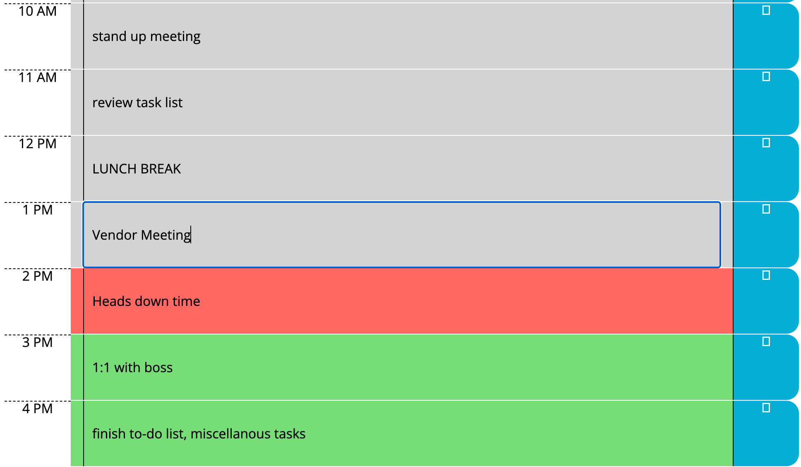

# HTMLJavascript Quiz

* [Overview] (#Overview)
* [Installation] (#Installation)
* [Features] (#Features)
* [License] (#License)

## Overview
This is the complete package to create a day scheduler for working hours. You can enter and save your data into specific time boxes, as well as see a visual representation of past, present, and future hours.

## Installation
This HTML file requires a .CSS style sheet and .js file for javascript functionality. By placing the entire website folder on a server together, it can be uploaded to a server, and the files can be found. Additionally, several stylesheets and scripts are, respectively, at the top and bottom of the index.html document to link to cdn and .min.js files elsewhere on the internet.

## Features
The current date is displayed at the top of the page. Click on the middle column to input a task, and hit the save button to the right, to save it. If you refresh your page, it will still be there. Hours in the past will have gray backgrounds, hours in the future will have green backgrounds, and the present hour will have a red background.

 


## License 
Source: choosealicense.com
```
This is free and unencumbered software released into the public domain.

Anyone is free to copy, modify, publish, use, compile, sell, or
distribute this software, either in source code form or as a compiled
binary, for any purpose, commercial or non-commercial, and by any
means.

In jurisdictions that recognize copyright laws, the author or authors
of this software dedicate any and all copyright interest in the
software to the public domain. We make this dedication for the benefit
of the public at large and to the detriment of our heirs and
successors. We intend this dedication to be an overt act of
relinquishment in perpetuity of all present and future rights to this
software under copyright law.

THE SOFTWARE IS PROVIDED "AS IS", WITHOUT WARRANTY OF ANY KIND,
EXPRESS OR IMPLIED, INCLUDING BUT NOT LIMITED TO THE WARRANTIES OF
MERCHANTABILITY, FITNESS FOR A PARTICULAR PURPOSE AND NONINFRINGEMENT.
IN NO EVENT SHALL THE AUTHORS BE LIABLE FOR ANY CLAIM, DAMAGES OR
OTHER LIABILITY, WHETHER IN AN ACTION OF CONTRACT, TORT OR OTHERWISE,
ARISING FROM, OUT OF OR IN CONNECTION WITH THE SOFTWARE OR THE USE OR
OTHER DEALINGS IN THE SOFTWARE.

For more information, please refer to <https://unlicense.org>
```